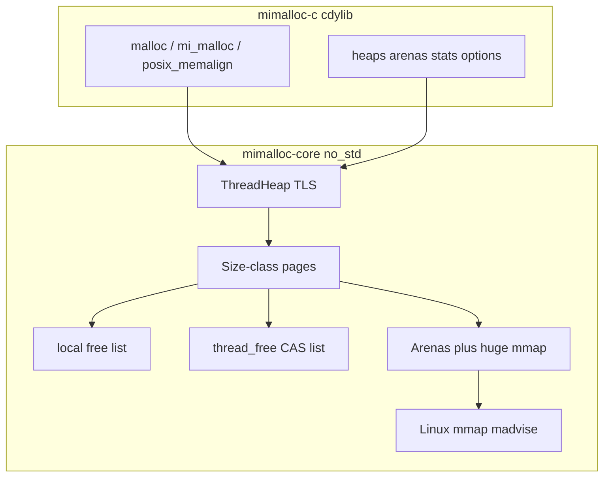

# Rust mimalloc: ABI-compatible drop-in rewrite

This tree is **mimalloc v3.5.0**. The public C surface lives in `[include/mimalloc.h](include/mimalloc.h)` (~150 exported functions plus POSIX/C++ overrides). NixOS `[environment.memoryAllocator.provider = "mimalloc"](https://github.com/NixOS/nixpkgs/blob/master/nixos/modules/config/malloc.nix)` preloads `${pkgs.mimalloc}/lib/libmimalloc.so` and needs libc allocation symbols.

Keep the C sources as a **reference and differential oracle**. Do not delete them until the Rust library is production-ready.

## Current status

Phase 1 (NixOS preload) and most of Phase 2 (`mi_*`, heaps, arenas, options, stats) are **implemented** in `[rust/](rust/)`. Mitigations that C gates behind `MI_SECURE` are always on. Both SONAMEs are installed (`libmimalloc.so.3` and `libmimalloc-secure.so.3`) so nixpkgs mold's `DT_NEEDED` does not stack C mimalloc. The glibc cdylib must `DT_NEEDED libc.so.6` and must not export unversioned `U atexit` (use `__cxa_atexit`).

Validation that must keep passing (see `[.cursor/rules/allocator-validation.mdc](.cursor/rules/allocator-validation.mdc)` and `[rust/README.md](rust/README.md)`):

- Compiler suites (GCC/Clang/rustc) **run** under `LD_PRELOAD` and match system malloc stdout/stderr/exit; rustc is compared to **C mimalloc and jemalloc**.
- Musl Linux (`x86_64` / `aarch64`) plus wasm32 (no libc).
- NixOS-world packages (python3, Node.js, KWin/KDE, …) via `mimalloc-harness world`.
- Firefox / Chromium / Electron via `mimalloc-harness browsers`.
- Bun and Serde via `mimalloc-harness projects` (bun scratch stays under `/tmp/mimalloc-projects`, not `rust/target`).
- **VMA 3.4**: `mimalloc-harness vma` — virtual block, 3.4 layout/symbols, Blender GHOST-style fake-Vulkan smoke.

## Design choices

- **Inspired rewrite**, not a line-for-line C port. Keep mimalloc’s ideas (size-class pages, sharded free lists, lock-free cross-thread free, arenas, eager purge). Internals may differ.
- **Phased ABI** (done in that order): malloc override first, then the full `mi_*` API.

Prior art: [rusty_alloc](https://github.com/Remade-With-Rust/rusty_alloc) is a separate v2.4.5-inspired remake. We do **not** depend on it.

## Target ABI (what “drop-in” means)

**Phase 1 (NixOS preload)** — ELF `libmimalloc.so` / `libmimalloc.so.3`:

- `malloc`, `free`, `calloc`, `realloc`
- `posix_memalign`, `aligned_alloc`, `memalign`, `valloc`, `pvalloc`
- `reallocarray`, `malloc_usable_size` / `malloc_size`
- `strdup`, `strndup` (some libcs do not route these through `malloc`)
- matching `mi_*` names (`mi_malloc` ≡ `malloc`, …)
- Itanium C++ `operator new/delete` (same set as `[src/alloc-override.c](src/alloc-override.c)`)

C mimalloc no longer exports `strdup` / `reallocarray` / `__libc_*` by default (`-DMI_OVERRIDE_LIBC_EXTRAS=OFF`) so PartitionAlloc is not handed foreign pointers. Browser smokes use that build.

**Phase 2 (linked libmimalloc)** — every `mi_decl_export` in `[include/mimalloc.h](include/mimalloc.h)`. Opaque types may differ internally. Layout-stable public structs/enums must match C:

- `mi_option_t` numeric values
- `mi_heap_area_t`
- `mi_stats_t` / `MI_STAT_VERSION` in `[include/mimalloc-stats.h](include/mimalloc-stats.h)`
- `mi_subproc_id_t`
- `MI_MALLOC_VERSION` (30500 for v3.5.0) from `mi_version()`

Install layout matches CMake: `libmimalloc.so.3` (SOVERSION = major), headers under `include/`, optional `libmimalloc.a`.

## Architecture

Each page has a **thread-local free list** (no atomics) and a **concurrent free list** (single CAS from other threads).

**Hard constraints for a preload `.so`:**

- Core is `#![no_std]`, no `alloc` crate, `panic = abort`. Linking `libstd` into a malloc replacement invites recursion.
- OS memory via **direct syscalls** on Linux. Never call libc helpers that themselves `malloc`.
- First `malloc` bootstraps (malloc-before-constructor).
- Fork safety: `pthread_atfork` (or equivalent).
- Metadata is not `Box`/`Vec` in the first pages.

## Repo layout

Cargo workspace under `[rust/](rust/)` (C tree stays at repo root):

- `[rust/crates/mimalloc-core](rust/crates/mimalloc-core)` — allocator internals (`no_std`)
- `[rust/crates/mimalloc-c](rust/crates/mimalloc-c)` — `cdylib` + `staticlib`; `#[no_mangle] extern "C"`; GNU `--defsym` aliases
- `[rust/crates/mimalloc-harness](rust/crates/mimalloc-harness)` — oracle, world, browsers, projects, VMA
- `[rust/crates/vma-core](rust/crates/vma-core)` / `[vma-c](rust/crates/vma-c)` — AMD VMA **3.4** C ABI
- `[rust/package.nix](rust/package.nix)` + `[flake.nix](flake.nix)` overlay → `pkgs.mimalloc`

`mimalloc-core` also implements `GlobalAlloc` (`Mimalloc`) for wasm and Rust programs.

## Vulkan Memory Allocator (3.4)

Drop-in for AMD VMA v3.4.0: `libVulkanMemoryAllocator.so.3`, declarations-only `[rust/crates/vma-c/include/vk_mem_alloc.h](rust/crates/vma-c/include/vk_mem_alloc.h)`. New vs 3.3: `minAlignment`, `vkGetPhysicalDeviceProperties2KHR`, dedicated allocate/create with `pMemoryAllocateNext`. Device tests use fake Vulkan (no GPU), including a Blender GHOST / OpenXR-style suite (`rust/tests/vma-blender.c` + `vma-core` mock).

## Verification (how we test)

- `cargo test -p mimalloc-core` / `mimalloc-harness`; `./tests/run.sh`
- Compiler oracle: `./tests/oracle-suites.sh` (rewrite ⊆ C mimalloc and jemalloc FAIL sets)
- World / browsers / projects / VMA harness commands
- Nix: `nix flake check` (glibc, musl, mold, vma, world-preload, browsers-preload)
- Kani proofs on integer helpers (`./tests/kani.sh`)
