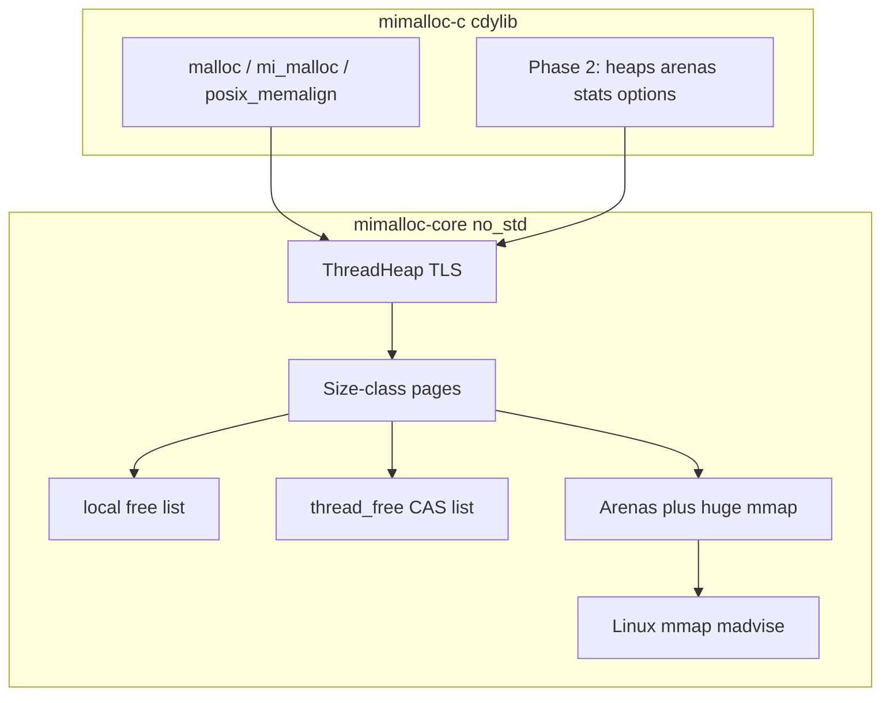

# Rust mimalloc: ABI-compatible drop-in rewrite

This tree is **mimalloc v3.5.0**. The public C surface lives in [`include/mimalloc.h`](include/mimalloc.h) (~150 exported functions plus POSIX/C++ overrides). NixOS does **not** need that full surface on day one: [`environment.memoryAllocator.provider = "mimalloc"`](https://github.com/NixOS/nixpkgs/blob/master/nixos/modules/config/malloc.nix) only preloads `${pkgs.mimalloc}/lib/libmimalloc.so` and requires libc allocation symbols.

Keep the C sources as a **reference and differential oracle**. Do not delete or replace them until the Rust library is production-ready.

## Design choices (from you)

- **Inspired rewrite**, not a line-for-line C port. Keep mimalloc’s ideas (size-class pages, sharded free lists, lock-free cross-thread free, arenas, eager purge). Internals may differ.
- **Phased ABI**: malloc override first, then the full `mi_*` API.

Prior art: [rusty_alloc](https://github.com/Remade-With-Rust/rusty_alloc) is a separate v2.4.5-inspired remake. We will **not** depend on it. Target this repo’s **v3 ABI** and NixOS packaging ourselves; take lessons, not code.

## Target ABI (what “drop-in” means)

**Phase 1 (NixOS preload)** — ELF shared object named `libmimalloc.so` / `libmimalloc.so.3` that exports at least:

- `malloc`, `free`, `calloc`, `realloc`
- `posix_memalign`, `aligned_alloc`, `memalign`, `valloc`, `pvalloc`
- `reallocarray`, `malloc_usable_size` / `malloc_size`
- `strdup`, `strndup` (some libcs do not route these through `malloc`)
- matching `mi_*` names for the same functions (`mi_malloc` ≡ `malloc`, …)
- Itanium C++ `operator new/delete` mangled names (same set as [`src/alloc-override.c`](src/alloc-override.c)) so preloaded C++ programs do not mix heaps

**Phase 2+ (linked libmimalloc)** — every `mi_decl_export` in [`include/mimalloc.h`](include/mimalloc.h), plus reuse the existing C headers. Opaque types (`mi_heap_t`, `mi_theap_t`) may have any internal layout. Layout-stable public structs/enums must match C:

- `mi_option_t` numeric values
- `mi_heap_area_t`
- `mi_stats_t` / `MI_STAT_VERSION` in [`include/mimalloc-stats.h`](include/mimalloc-stats.h)
- `mi_subproc_id_t`
- `MI_MALLOC_VERSION` (30500 for v3.5.0) from `mi_version()`

Install layout should match CMake: `libmimalloc.so.3` (SOVERSION = major), headers under `include/`, optional `libmimalloc.a`.

## Architecture

Keep the C “big idea”: each page has a **thread-local free list** (no atomics) and a **concurrent free list** (single CAS from other threads). That is what makes a preload viable under real multithreaded NixOS services.

**Hard constraints for a preload `.so`:**

- Core is `#![no_std]`, no `alloc` crate, `panic = abort`. Linking `libstd` into a malloc replacement invites recursion (libstd allocates via `malloc`, which is us).
- OS memory via **direct syscalls** on Linux (`rustix` `linux_raw`, or thin `libc` mmap used only after checking it cannot allocate). Never call libc helpers that themselves `malloc`.
- Process/thread init must tolerate **malloc-before-constructor** (first `malloc` bootstraps).
- Fork safety: `pthread_atfork` (or equivalent) so child heaps are consistent.
- No heap use for metadata in the first pages: metadata lives in the arena / static BSS, not `Box`/`Vec`.

## Repo layout

New Cargo workspace under [`rust/`](rust/) (C tree stays at repo root):

- [`rust/Cargo.toml`](rust/Cargo.toml) — workspace
- [`rust/crates/mimalloc-core`](rust/crates/mimalloc-core) — allocator internals (`no_std`)
- [`rust/crates/mimalloc-c`](rust/crates/mimalloc-c) — `cdylib` + `staticlib`; `#[no_mangle] extern "C"`; GNU `--defsym` aliases (`malloc` → `mi_malloc`) like C `MI_FORWARD`
- [`rust/crates/mimalloc`](rust/crates/mimalloc) — optional later: `GlobalAlloc` for Rust programs (not required for NixOS preload)
- [`rust/package.nix`](rust/package.nix) + [`flake.nix`](flake.nix) overlay that provides `pkgs.mimalloc` from the Rust build so `environment.memoryAllocator.provider = "mimalloc"` just works

Linker: `-C link-arg=-Wl,-soname,libmimalloc.so.3` and `-C link-arg=-Wl,--version-script=...` only if we add a symbol map; Phase 1 can ship unversioned default-visibility exports.

## Phase 1 internals (first implementation)

Size classes: reuse mimalloc’s 73-bin / 12.5% spacing from [`include/mimalloc/types.h`](include/mimalloc/types.h) so Phase 2 stats bins match and fragmentation behavior stays familiar.

Minimum viable core:

1. **OS layer** (`os.rs`): `mmap`/`munmap`, `madvise` (DONTNEED/FREE), optional THP `prctl`, alignment for 64KiB slices.
2. **Page**: fixed-size region of equal blocks; local + concurrent free lists; empty-page purge.
3. **Thread heap**: per-thread page queues per bin; TLS via ELF `#[thread_local]` if we accept nightly, otherwise a pthread-key / Linux `arch_prctl` TLS slot (C already has several TLS models in CMake).
4. **Huge path**: sizes above large-page threshold go straight to mmap; `free` recovers size via a page-map or header (a sparse page map like C `page-map.c` is the robust choice for `free(unknown)`).
5. **C shims**: `errno = ENOMEM` on failure; `calloc` overflow checks; `realloc(NULL, n)` / `realloc(p, 0)` POSIX behavior; `posix_memalign` EINVAL on bad alignment.

Out of scope for Phase 1: secure mode, Valgrind/ASAN, Windows/macOS, first-class heaps, arenas API, `mi_option_*`, stats structs, C++ `mi_new` new-handler / `bad_alloc`.

## Verification

- Rust unit tests in `mimalloc-core` (size-class math, free-list, page map) using a test-only std harness.
- C smoke: compile a tiny `malloc`/`free`/`realloc`/`posix_memalign` program and run with `LD_PRELOAD=./libmimalloc.so`.
- Stress: existing [`test/test-stress.c`](test/test-stress.c) linked against glibc but preloaded with our `.so`.
- Later (Phase 2): compile [`test/test-api.c`](test/test-api.c) against our library + [`include/mimalloc.h`](include/mimalloc.h).
- Nix: `nix build` the overlay package; confirm `nm -D` shows `malloc`/`free` and file is `libmimalloc.so`.

## Implementation order after approval

Phase 1 is the work to implement next. Later phases are roadmap only.

1. Scaffold workspace, `no_std` core, Linux mmap OS layer, panic/abort, cdylib skeleton.
2. Size classes, pages, thread-local + CAS free lists, page map, huge mmap path.
3. Export libc + `mi_*` malloc family; soname; LD_PRELOAD smoke + stress.
4. Nix `package.nix` / flake overlay replacing `pkgs.mimalloc`.
5. **Roadmap (not this sprint):** heaps/theaps, options, stats, arenas, reuse C headers, `test-api.c`, musl/aarch64, secure mode.
